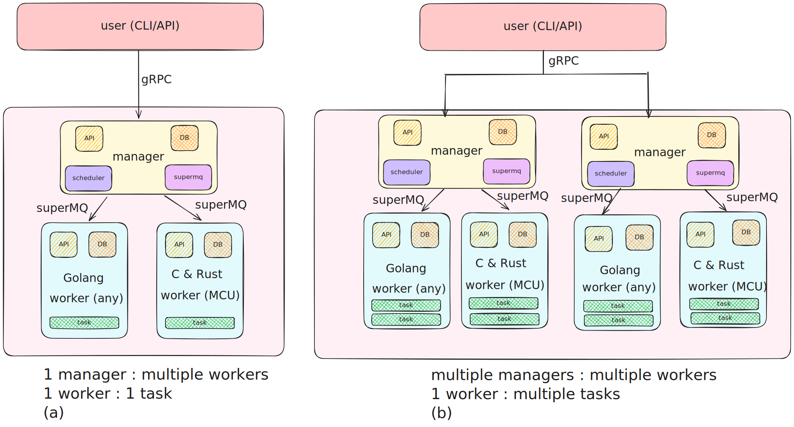

## 🏗️ Architecture Overview

Propeller's architecture consists of three key components:

### 1. **User Interface (CLI/API)**

- Provides users with tools to interact with Propeller, whether via a command-line interface (CLI) or RESTful API.

### 2. **Manager**

- Acts as the control hub, responsible for workload scheduling and orchestration.
- Integrates a **scheduler** for efficient resource allocation and workload distribution.
- Maintains an internal database for tracking workloads, worker states, and metadata.
- Currently, the system supports **1 manager : multiple workers** as shown in (a). In the future, the system will be expanded to support **multiple managers : multiple workers** as shown in (b).

### 3. **Workers**

- Responsible for executing workloads based on instructions from the manager.
- All workers operate within the same communication channel.
- Two worker types are supported:
  - **Golang Workers**: Designed for general-purpose workloads on cloud or edge devices.
  - **C & Rust Workers**: Optimized for constrained microcontroller environments, enabling lightweight and efficient task execution.
- Workers communicate using multiple protocols:
  - MQTT and CoAP for constrained devices.
  - WebSocket (WS) for other devices.
- The worker can run multiple jobs.
- At present, the system is configured to support a **1 worker : 1 task** execution for simplicity model as shown in (a).

---
